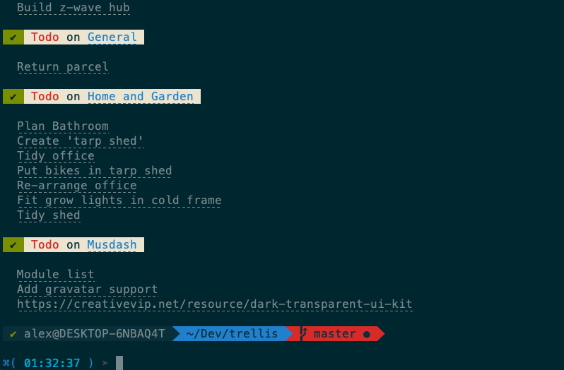

# Trellis

[](https://npmjs.org/package/@foxleigh81/trellis "View this project on npm")

A node cli app which takes a list of cards from a trello list

## Installation instructions

in your command line, type `npm install -g @foxleigh81/trellis`

Visit http://trello.com/app-key and get your API key and App Token (manually generated)

Back in the command line type:

```bash
  export API_KEY=[your api key]
  export APP_TOKEN=[your app token]
```

## Usage

In your command line type `trellis`.

By default it will only look for lists named `Todo`. However you can edit the `listNameArray` variable in `index.js` to add, edit any lists you like (case-sensitive)

## Example



## Roadmap and Issues

This is a pretty new project and is still unfinished and buggy. If you spot any issues, please log them here:

https://github.com/foxleigh81/trellis/issues

This is also a good place to go if you are interested in seeing what features I'm planning next.

## Thanks and Acknowledgements

Inspiration and a fair bit of configuration code for this project came from https://github.com/mheap/trello-cli